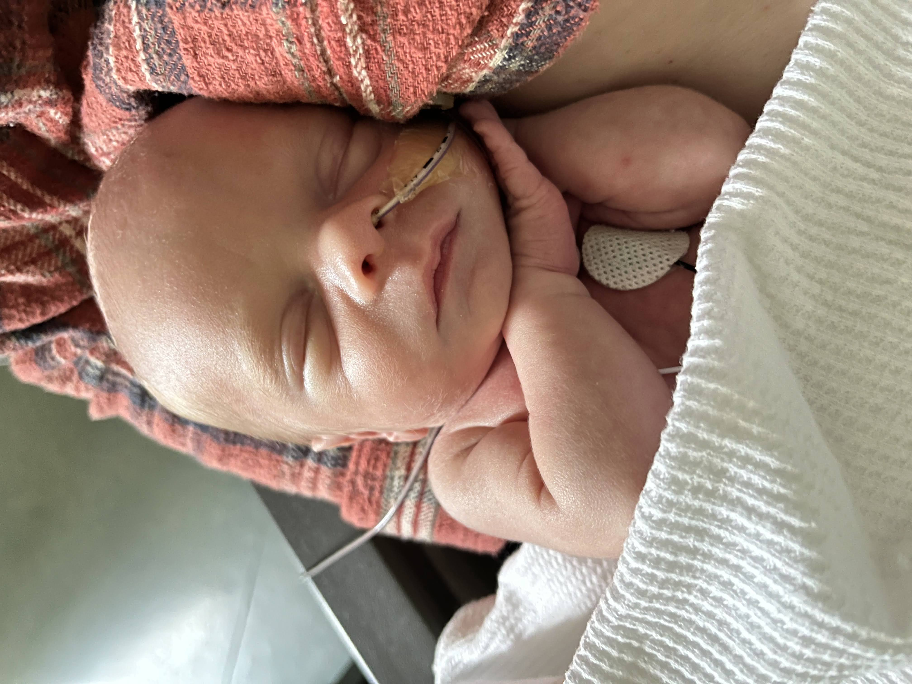
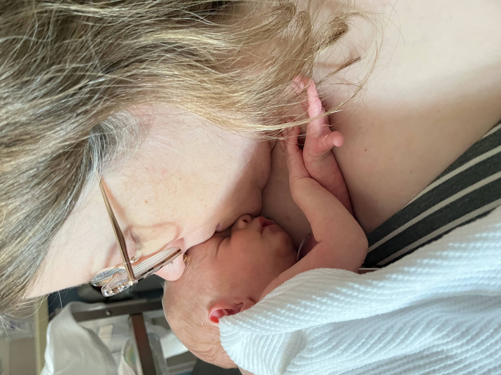
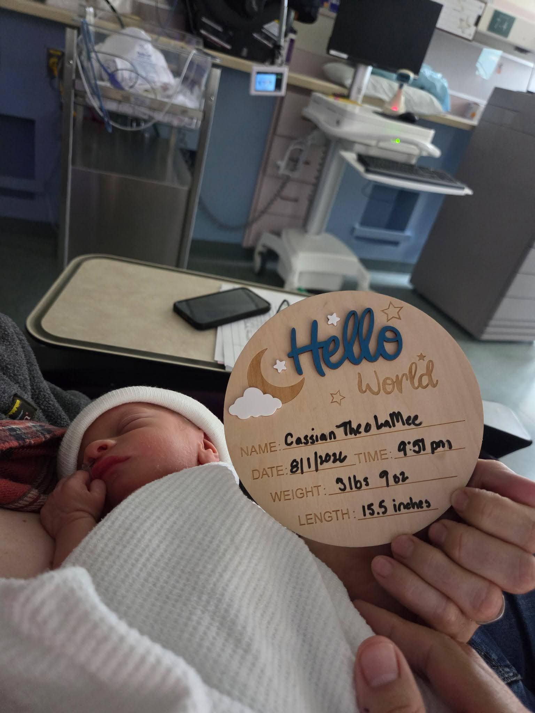
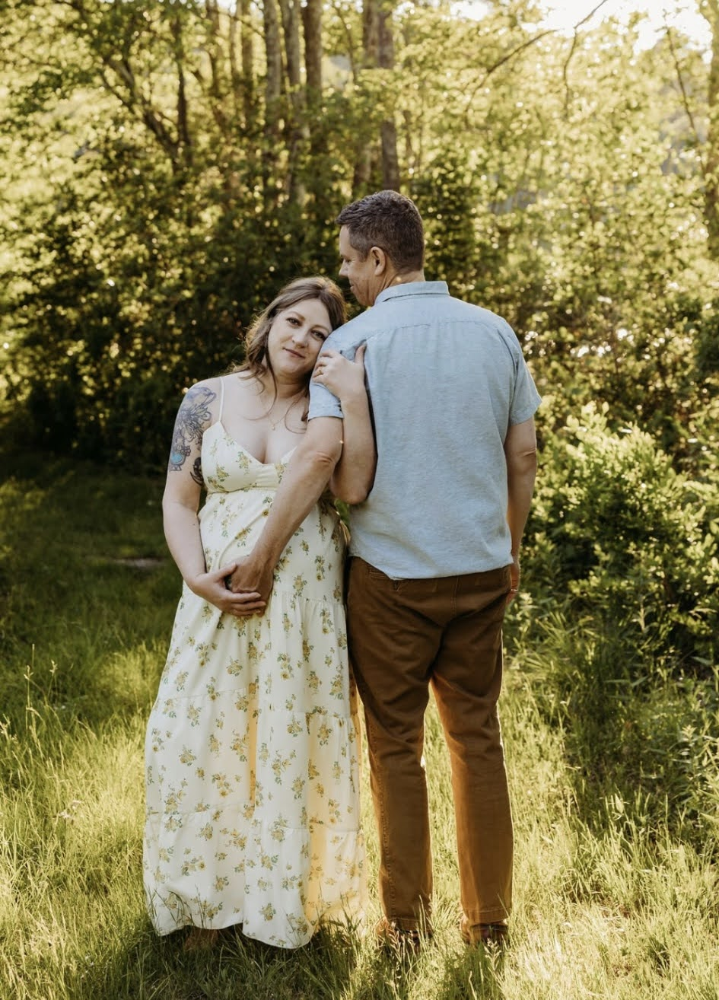

## Cassian Theo is excited to meet you! 

He came a little early and is still in the NICU, but doing really great and gaining plenty of weight. It was a bit of a nervous pregnancy with Cass being so tiny (born at 3 lbs 10 oz), so we opted to plan a shower once he's home with us. That could be whenever he’s taking 100% of his milk via mouth rather. Maybe late August? Maybe September? We’re visiting him daily for lots of love and skin-to-skin time. Natalie’s taking time to heal and Adam’s home from work for three months. All good things. 

Reminder for those up for visiting Cass when he gets home: you’ll need a recent TDAP booster until he’s 6 months old.

Friends have set up a [MealTrain](https://www.mealtrain.com/trains/me5v86) if you'd like to participate.

You can view Cassian's registries at:
[Walmart](https://www.walmart.com/registry/BR/ad39ea70-6ffe-4d37-a9a8-d14ba584faca)
[Crate & Barrel](https://www.crateandbarrel.com/gift-registry/adam-lamee-and-natalie-papienski/r7612879)
Knowing you may want to get him cute things to wear, we didn’t include clothing in the registries. You’re welcome to take that in whatever direction calls to you. Not limited to these, but Cass’s signature colors are blue-grey and yellow-gold with patterns including lions, dinosaurs, stars/planets, and Star Wars.
  
  

